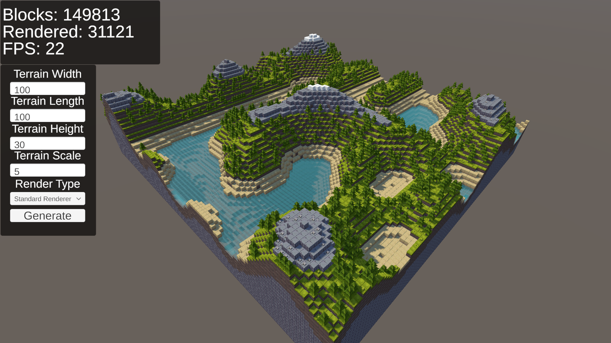
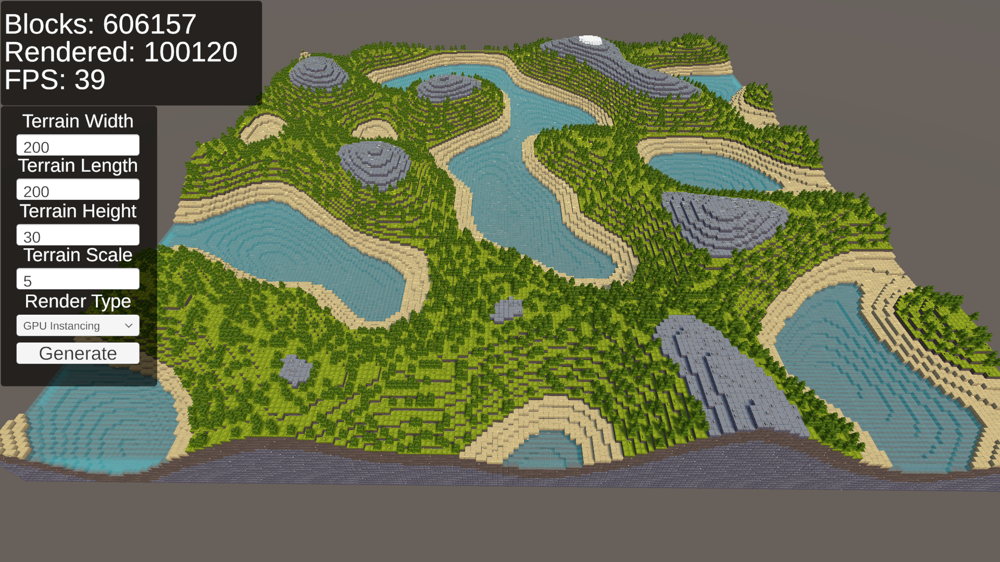
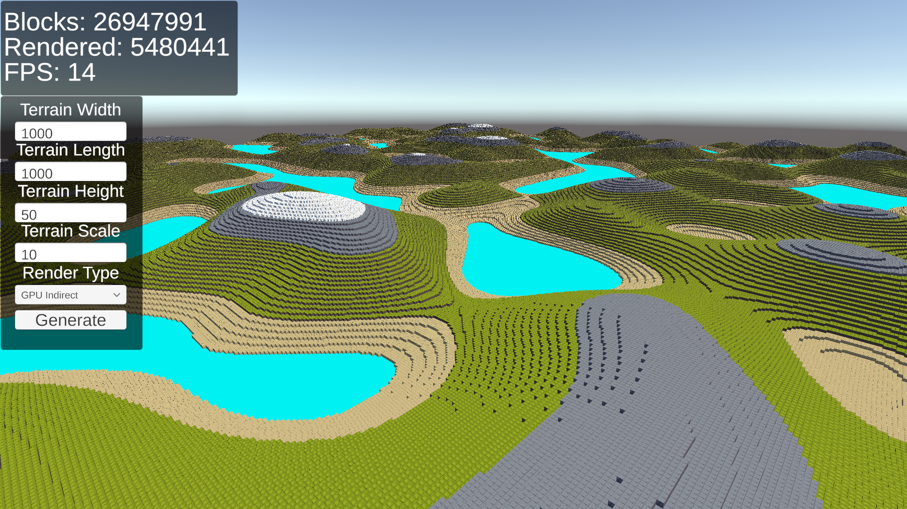

# Voxel World
A project dedicated to experimental voxel world generation with random noise algorithms. This project was made in Unity. This project has had all paid assets removed.

## Play Now

Download the application for free on Windows, Mac and Linux from: 

  
  
  

## Features

### Experimental Tools

A sandbox world with multiple parameters to generate unique and random worlds.

### Rendering and Performance Optimizations

Switch between multiple rendering methods such as Unity's standard Instantiation, GPU Instancing, and Indirect GPU Instancing in addition to other parameters to compare performance differences.

### Random Noise Generation

Generate worlds with a mixture of different random noise algorithms and parameters. Currently only Perlin Noise is supported, but more noise algorithms will be coming soon.

## Dependencies

This project uses the following paid assets:

- [Cube World](https://assetstore.unity.com/packages/3d/environments/fantasy/cube-world-115613)
